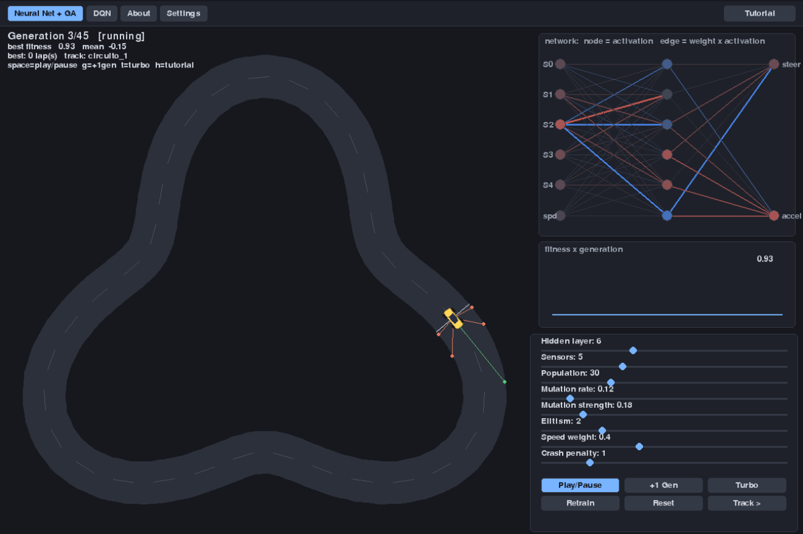
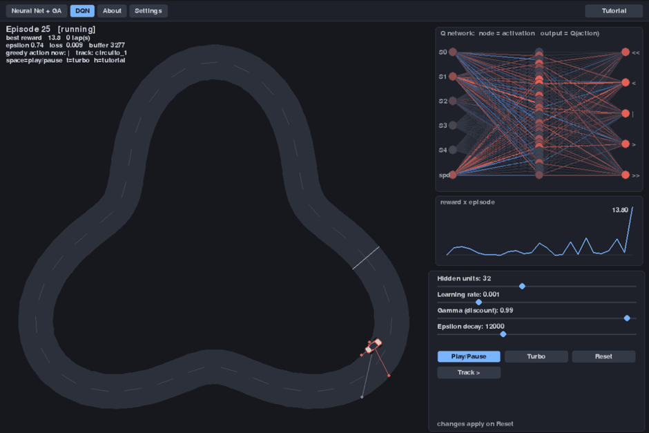
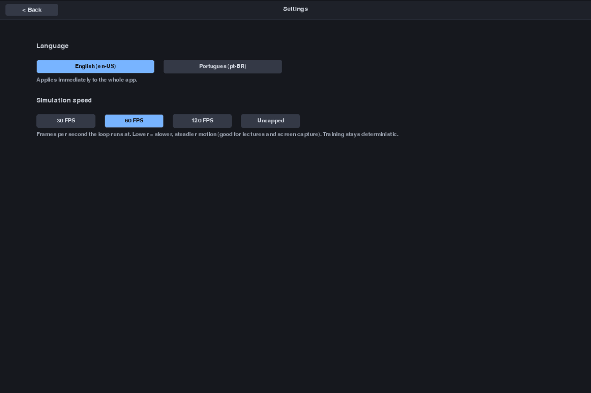

# Autonomous Vehicle Simulator — Neural Networks (GA & DQN)

A neural network learns — in front of you — to drive a car around a winding track using only
distance sensors (raycasts). You watch the car on the track and the **neurons and
connections lighting up** at the same time, and you can **change the hyperparameters and
retrain**.

Didactic project. Runs on the **desktop** and in the **browser** (WebAssembly via pygbag),
from the same Python code. UI in **English** and **Portuguese (pt-BR)** — switch in Settings.


- [Work plan](docs/plano-de-trabalho.md) · [PRD](docs/prd.md) · [Architecture](docs/arquitetura.md) · [Tutorial GA](docs/tutorial_ga.md) · [Tutorial DQN](docs/tutorial_dqn.md) · [About](docs/sobre.md)

## Screens

The app opens on **Solution 1 (Neural Net + GA)**. A **top menu bar** has the tabs:

| | |
|---|---|
| **Neural Net + GA** (neuroevolution) — a population of MLPs; the best reproduce. No gradient. *(default)* |  |
| **DQN** (Deep Q-Network) — a Q network learns by gradient + replay buffer + target network; backprop written by hand in NumPy. The visualisation runs at a fixed pace, decoupled from training. |  |
| **About** — project description. | |
| **Settings** — app **language** (English / Portuguese) and **simulation speed** (30 / 60 / 120 FPS / uncapped). Both persist. |  |

Inside each simulation, the **Tutorial** button opens the tutorial **specific to that
technique**; **Back** returns. Each tutorial starts with the **raycast sensor** model and
has a **Download PDF** button.

## How it works (in brief)

- **Sensors:** 5 rays in a fan measure the distance to the wall, normalised to `[0,1]`.
- **Network input:** distances + speed. **Output:** steering/throttle (GA) or the Q of 5
  discrete actions (DQN).
- **UI-free core:** `src/core/` depends only on `numpy` + stdlib (runs in Pyodide/WASM).
  `src/app/` (Pygame) is a client of the core. Training runs **thread-free**, inside the loop.

## Run on the desktop

```bash
uv venv
uv pip install -e ".[dev]"
uv run python main.py
```

Common keys: `esc` (in text screens) = Back · `space` play/pause · `t` turbo · `h` tutorial.
GA only: `g` = +1 generation.

## Native executable (no Python needed to run)

```bash
uv pip install -e ".[build,docs]"
python scripts/build_exe.py                       # -> dist/AutonomousVehicleSimulator[.exe]  (current OS)
python scripts/package_release.py --os-name linux # -> dist/AutonomousVehicleSimulator-<version>-linux.zip
```

PyInstaller does not cross-compile. Pushing a tag `vX.Y.Z` runs the
[release workflow](.github/workflows/release.yml): it builds Windows / macOS / Linux,
zips each, and publishes a **GitHub Release** whose notes are the matching
[CHANGELOG](CHANGELOG.md) section plus the auto-generated commit list. The tag must
match `__version__` in [src/__init__.py](src/__init__.py) (single source of truth;
`pyproject.toml` reads it). To cut a release: bump `__version__`, add a `## [X.Y.Z]`
block to the CHANGELOG, commit, then `git tag vX.Y.Z && git push --tags`.

## Run in the browser (local build)

```bash
uv pip install -e ".[web,docs]"
bash scripts/serve_web.sh            # builds if needed, serves build/web/
# open  http://127.0.0.1:8080
```

**Open `http://127.0.0.1:8080`, not `localhost`, and do not use `python -m pygbag` to serve.**
The local preview mirrors GitHub Pages: static files, no COOP/COEP headers, and the origin
must not be `localhost` (otherwise pygbag enters "dev mode" and looks for a local package
server that a static server does not have). The first visit downloads the Python/NumPy/pygame
runtime from the CDN (~20 MB, cached afterwards). The build also emits
`tutorial_ga.html/.pdf` and `tutorial_dqn.html/.pdf`.

> pygbag packages dependencies from the `import`s in the **root `main.py`** (no recursive
> scan) — that is why `main.py` has `import pygame` / `import numpy` at the top plus a PEP
> 723 block. Without them `pygame` is not bundled and the app breaks at `pygame.init()`.

## Tests, lint, CI

```bash
uv run pytest -q            # includes the slow end-to-end learning tests (GA and DQN)
uv run ruff check .
```

[CI](.github/workflows/ci.yml) runs ruff + the full test battery + a headless screen-cycle
smoke on every push/PR.

## Layout

```
main.py            entry point (desktop + pygbag)
src/
  core/            config, geometry, track, sensors, network, simulation, evolution,
                   trainer (GA)  ·  dqn (QNet + Replay + DQNTrainer)
  app/             main (router) · gascreen · dqnscreen · docscreen · settingsscreen
                   scene · netview · plot · widgets · camera · chrome (menu bar) · docview · i18n · links
  tracks/          circuito_1..3 (JSON)
docs/              tutorial_ga.md, tutorial_dqn.md, sobre.md (+ .pt-BR), plan, prd, arch, media/
scripts/           build_web.sh, serve_web.sh, deploy_hf.sh, build_exe.py, package_release.py,
                   record_media.py, train_headless.py, assets/
tools/             make_track.py, md2html.py, md2pdf.py
.github/workflows/ ci.yml, release.yml, deploy-pages.yml
CHANGELOG.md · LICENSE (MIT)
```

## Publishing

Static site — GitHub Pages ([deploy workflow](.github/workflows/deploy-pages.yml)) or Hugging
Face Spaces (Static SDK, `scripts/deploy_hf.sh`). Step by step in [docs/publicacao.md](docs/publicacao.md).
